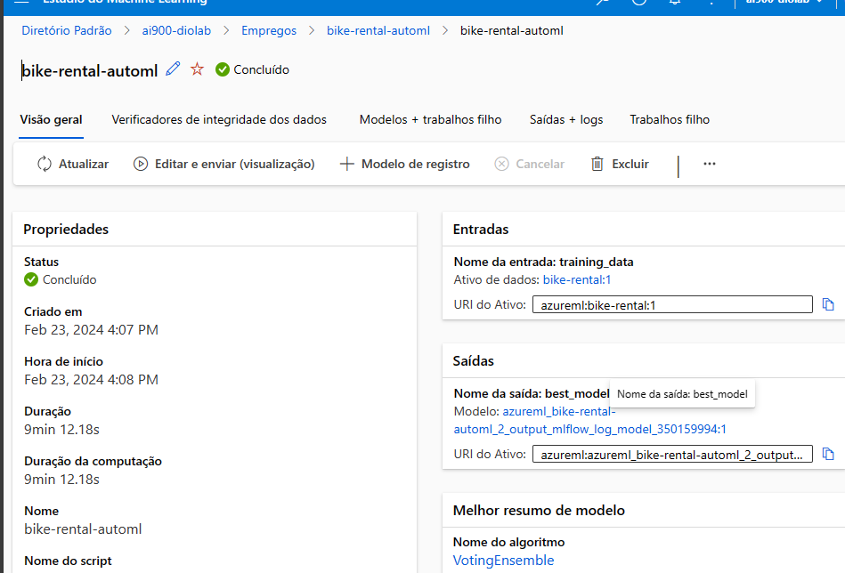

# Machine Learning

## Passos necessários para criar treinar e testar um recurso de Machine Learning na Azure:

_Ref.: https://microsoftlearning.github.io/mslearn-ai-fundamentals/Instructions/Labs/01-machine-learning.html_

  - _Tenha/ crie uma conta azure, um grupo de recursos e e um recurso de Machine Learning_
    - Quando for cirado o recurso de ML no Portal Azure, os demais recursos necessários serão criados automáticamente.
  - _Depois do recurso criado, acesse o estúdio da azure.ai pelo link indicado no próprio recurso criado e procure por 'ml lçearning automatizado'. Crie/envie um novo ML Automatizado._
    - Nessa parte será necessária criar um ativo / uma fonte de dados. Faça as configurações de acordo com o documento de referência, para esse teste. Especialmente na configuração de tarefas há muitas configurações que podem variar de projeto para projeto.
  
  - _Ao final, clique em 'enviar traballho de treinamento, para realizar o treinamento' do modelo com as configurações criadas_

  - **Fazendo o teste e a análiise do modelo treinado**

  - acesse o ML Automatizado e o trabalho q vc rodou para acessar detalhes da tarefa

  - acesse Modelos / Registro para acessar  detalhes de anãlise de testese gráficos de predição

  - realize testes diretamente em 'endpoints' ('pontos de extremidade')

  
  
  
  **Meu trabalho de treinamento:**

  

